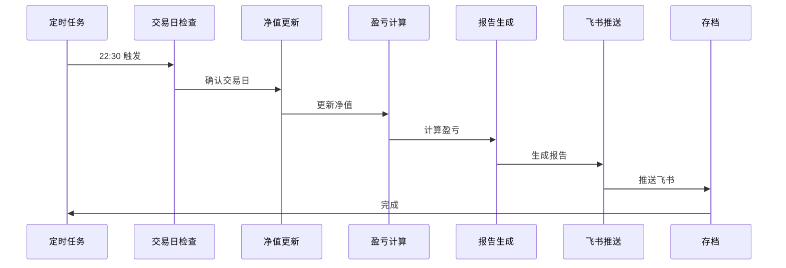

# 基金日终复盘

**每日交易结束后自动生成复盘报告并推送到飞书群**

---

## 📋 复盘流程

### 执行时间

```
每个交易日 22:30 自动执行（收盘后 3.5 小时，确保净值更新完成）
```

### 执行内容

1. **交易日检查** - 确认是否为交易日
2. **净值更新** - 更新所有持仓最新净值
3. **盈亏计算** - 计算当日盈亏和累计收益
4. **报告生成** - 生成富文本复盘报告
5. **推送通知** - 推送到飞书群

---

## 📊 复盘报告模板

### 报告结构

```markdown
📊 基金日终复盘

【持仓概览】
• 持仓数量：X 只
• 投入本金：XXX.XX 元
• 浮动盈亏：+/-XX.XX 元
• 组合总值：XXX.XX 元

【持仓明细】
• 基金代码 基金名称：+/-XX.XX 元
• 基金代码 基金名称：+/-XX.XX 元
• 基金代码 基金名称：+/-XX.XX 元

【今日操作】
• 买入：基金代码 XXX 元
• 卖出：基金代码 XXX 元
• 持有：无操作

【明日计划】
• 观察基金：基金代码
• 关注板块：XXX 板块
• 风险提示：XXX

⚠️ 风险提示：历史业绩不代表未来表现
```

---

## 🛠️ 脚本说明

### 核心脚本

| 脚本 | 作用 | 调用时机 |
|------|------|----------|
| `auto_review_automation.py` | 自动复盘全流程 | 22:30 |
| `daily_pnl_updater_v2.py` | 更新净值和盈亏 | 22:30 |
| `daily_review_generator.py` | 生成复盘报告 | 22:30 |

### 使用示例

```bash
# 生成日终复盘报告
python3 scripts/daily_review_generator.py \
  --state fund_challenge/state.json \
  --ledger fund_challenge/ledger.jsonl \
  --output reviews/review-2026-03-12.md

# 推送到飞书群
curl -X POST "YOUR_FEISHU_WEBHOOK" \
  -H "Content-Type: application/json" \
  -d '{
    "msg_type": "interactive",
    "card": {
      "header": {
        "title": {"tag": "plain_text", "content": "📊 基金日终复盘"},
        "template": "green"
      },
      "elements": [
        {
          "tag": "div",
          "text": {
            "tag": "lark_md",
            "content": "**【持仓概览】**\n• 持仓数量：3 只\n• 投入本金：999.52 元\n• 浮动盈亏：-11.17 元\n• 组合总值：988.35 元"
          }
        }
      ]
    }
  }'
```

---

## 📁 文件结构

```
08-fund-daily-review/
├── reviews/                    # 复盘报告存档
│   ├── review-2026-03-12.md
│   ├── review-2026-03-11.md
│   └── ...
├── templates/                  # 报告模板
│   ├── daily_review_template.md
│   └── feishu_card_template.json
└── scripts/                    # 脚本工具
    ├── daily_review_generator.py
    ├── daily_pnl_updater.py
    └── feishu_push_sender.py
```

---

## 🔧 配置说明

### 飞书 Webhook 配置

```bash
# 在飞书群添加机器人
1. 打开飞书群设置
2. 选择 "群机器人"
3. 点击 "添加机器人"
4. 选择 "自定义机器人"
5. 复制 Webhook 地址

# Webhook 地址格式
YOUR_FEISHU_WEBHOOK (请替换为实际的飞书机器人 webhook URL)
```

### 定时任务配置

```json
{
  "name": "fund-2230-review",
  "description": "基金挑战 - 22:30 日终复盘（增强版）",
  "schedule": "30 22 * * 1-5",
  "timeoutSeconds": 600,
  "retry": 2,
  "delivery": "feishu",
  "notify_on": ["always"],
  "script": "python3 .../auto_review_automation.py --base ...",
  "steps": [
    "1. 交易日检查 (is_trading_day.py) - 1 分钟",
    "2. 生成复盘报告 (含亏损原因分析 + 板块后市看法) - 5 分钟",
    "3. 更新 state.json 和 ledger.jsonl - 2 分钟",
    "4. Git 提交并推送到 GitHub 归档 ✅ 自动 - 2 分钟",
    "5. 飞书通知 GitHub 推送完成 ✅ 自动 - 1 分钟"
  ],
  "expectedDuration": "11 分钟"
}
```

---

## 📊 推送示例

### 飞书卡片消息

```json
{
  "msg_type": "interactive",
  "card": {
    "header": {
      "title": {
        "tag": "plain_text",
        "content": "📊 基金日终复盘"
      },
      "template": "green"
    },
    "elements": [
      {
        "tag": "div",
        "text": {
          "tag": "lark_md",
          "content": "**【持仓概览】**\n• 持仓数量：3 只\n• 投入本金：999.52 元\n• 浮动盈亏：-11.17 元\n• 组合总值：988.35 元"
        }
      },
      {
        "tag": "hr"
      },
      {
        "tag": "div",
        "text": {
          "tag": "lark_md",
          "content": "**【持仓明细】**\n• 013180 广发新能源车电池 ETF 联接 C: +7.54 元\n• 011612 华夏科创 50ETF 联接 A: -10.62 元\n• 014320 德邦半导体产业混合 C: -8.09 元"
        }
      },
      {
        "tag": "note",
        "elements": [
          {
            "tag": "plain_text",
            "content": "⚠️ 风险提示：历史业绩不代表未来表现，需谨慎投资"
          }
        ]
      }
    ]
  }
}
```

---

## 📈 复盘报告示例

### 2026-03-12 复盘报告

```markdown
# 基金日终复盘 - 2026-03-12

## 📊 持仓概览

| 项目 | 数值 |
|------|------|
| 持仓数量 | 3 只 |
| 投入本金 | 999.52 元 |
| 浮动盈亏 | +25.58 元 |
| 组合总值 | 1025.10 元 |
| 当日收益 | +12.34 元 |
| 累计收益 | +25.58 元 |

## 📈 持仓明细

| 基金代码 | 基金名称 | 持仓金额 | 当日盈亏 | 累计盈亏 |
|----------|----------|----------|----------|----------|
| 011612 | 华夏科创 50ETF 联接 A | 399.52 元 | -5.43 元 | -5.43 元 |
| 013180 | 广发新能源车电池 ETF 联接 C | 300.00 元 | +7.12 元 | +23.01 元 |
| 014320 | 德邦半导体产业混合 C | 300.00 元 | +23.89 元 | +8.00 元 |

## 🔄 今日操作

- **买入**: 无
- **卖出**: 无
- **持有**: 保持现有仓位

## 📋 明日计划

1. **观察基金**: 012631 华夏芯片 ETF 联接 A
2. **关注板块**: 科创 50、半导体
3. **风险提示**: 注意市场波动，控制仓位

## ⚠️ 风险提示

历史业绩不代表未来表现，投资需谨慎。
市场有风险，入市需谨慎。
```

---

## 🎯 自动化流程

### 执行流程图



---

## 📝 注意事项

### 数据准确性

- ✅ 净值数据来源于官方渠道
- ✅ 盈亏计算精确到分
- ✅ 推送前人工确认（可选）

### 推送时间

- ✅ 交易日 22:30 执行（11 分钟完成，约 22:41 推送）
- ✅ 非交易日自动跳过
- ✅ 失败自动重试（2 次，超时 10 分钟）

### 隐私保护

- 🔒 Webhook URL 使用占位符
- 🔒 敏感信息本地存储
- 🔒 报告存档定期清理

---

## 🔗 相关链接

- [飞书开放平台](https://open.feishu.cn/document/)
- [OpenClaw 定时任务](https://docs.openclaw.ai/cron)
- [基金挑战系统](README.md)

---

*最后更新：2026-03-20
