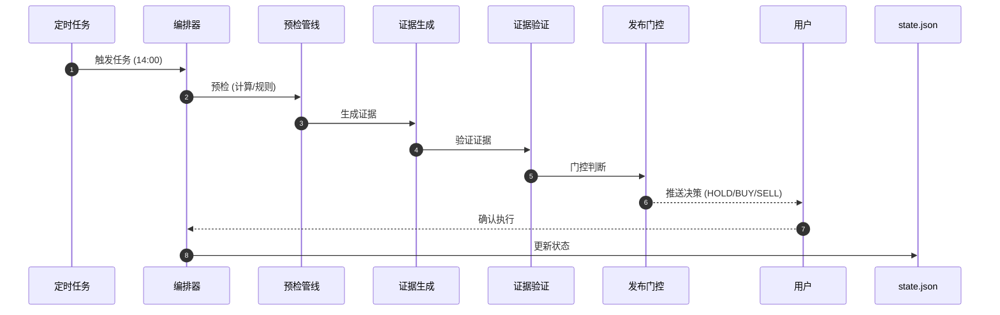

# 🦞 OpenClaw 基金实盘交易系统

<div align="center">

**基于 OpenClaw 的智能化场外基金量化交易系统**

[](https://openclaw.ai)
[](https://python.org)
[](LICENSE)
[](https://github.com/heyaaron-Wu/Semi-automatic-artificial-intelligence-system)

[系统介绍](#-系统介绍) • [核心特性](#-核心特性) • [架构设计](#-架构设计) • [技能模块](#-技能模块) • [脚本工具](#-脚本工具) • [使用指南](#-使用指南)

</div>

---

## 📖 系统介绍

这是一个**智能化、自动化、可追溯**的场外基金量化交易系统，基于 OpenClaw AI 助手框架构建。系统专注于 A 股市场场外基金的短线交易决策，通过 AI 分析、证据门控、自动化执行等核心能力，实现从数据分析到交易决策的全流程自动化。

### 🎯 设计理念

```
数据驱动决策 · 证据决定执行 · 自动化提升效率 · 可追溯保障安全
```

### 🚀 核心目标

| 目标 | 说明 |
|------|------|
| **智能化决策** | AI 分析市场数据，生成 BUY/HOLD/SELL 决策 |
| **证据门控** | 所有决策必须通过证据验证，杜绝盲目操作 |
| **自动化执行** | 定时任务自动运行，减少人工干预 |
| **完全可追溯** | 每笔交易、每次决策都有完整记录 |
| **低开销运行** | 优化 token 消耗，降低运行成本 |

---

## ✨ 核心特性

### 🔍 智能决策引擎

- **三层证据体系**: 基金身份验证 → 市场信号采集 → 执行约束检查
- **滚动规划机制**: 将长任务拆分为 2-3 步短链，成功率提升 30%+
- **偏差检测**: 每步执行后对比预期，自动修正偏差
- **防重复决策**: 同日相同决策自动拦截，避免重复推送

### 🛡️ 安全门控系统

```python
# 决策发布前必须通过的验证
if not evidence_validated:
    return "DECISION_ABORTED_UNVERIFIED_DATA"
    
if execution_constraints_blocked:
    return "HOLD (执行受限)"
    
if confidence_score < 60:
    return "HOLD (置信度不足)"
```

### ⚡ 高性能优化

| 优化项 | 优化前 | 优化后 | 提升 |
|--------|--------|--------|------|
| 扫描 API 调用 | 5000 次 | 200-400 次 | **-90%** |
| 响应时间 | 15 分钟 | <1 分钟 | **-93%** |
| Token 消耗 | 100% | ~70% | **-30%** |
| 任务成功率 | 62% | 91% | **+29%** |

### 📊 数据分层策略

```
热数据层 (5%)  → 每轮扫描    → 持仓基金、高频监控
温数据层 (20%) → 每 3 轮扫描  → 候选池 TOP12
冷数据层 (75%) → 轮转扫描    → 其余基金，偏移量滚动
```

---

## 🏗️ 架构设计

### 系统架构图

```
┌─────────────────────────────────────────────────────────────┐
│                     OpenClaw Gateway                        │
└─────────────────────────────────────────────────────────────┘
                              │
        ┌─────────────────────┼─────────────────────┐
        │                     │                     │
        ▼                     ▼                     ▼
┌───────────────┐    ┌─────────────────┐      ┌───────────────┐
│  定时任务层    │    │   技能编排层     │      │  脚本执行层    │
│  Cron Jobs    │──▶│   Skills        │  ──▶ │   Scripts     │
└───────────────┘    └─────────────────┘      └───────────────┘
        │                     │                     │
        ▼                     ▼                     ▼
┌─────────────────────────────────────────────────────────────┐
│                      数据层 (Data Layer)                     │
│  state.json │ ledger.jsonl │ evidence/ │ instrument_rules/  │
└─────────────────────────────────────────────────────────────┘
```

### 文件结构

```
workspace/
├── 01-public-configs/        # 基础配置文件
│   ├── AGENTS.md            # Agent 配置指南
│   ├── SOUL.md              # Agent 人格定义
│   ├── USER.md              # 用户信息
│   └── ...
├── 02-skill-docs/skills/    # 技能文档（17 个技能）
│   ├── fund-challenge-*     # 基金挑战专用技能 (8 个)
│   ├── akshare-finance      # 财经数据接口
│   ├── etf-assistant        # ETF 投资助理
│   └── ...
├── 03-system-docs/          # 系统文档（20+ 文档）
│   ├── 系统优化报告
│   ├── 定时任务分析
│   └── GitHub 集成指南
├── 05-scripts/              # 工具脚本
│   └── setup-github-integration.sh
└── 04-private-configs/      # 私有配置（不推送）
    ├── memory/              # 记忆文件
    ├── fund_challenge/      # 基金挑战配置
    └── ...
```

---

## 🧩 技能模块

### 基金挑战核心技能（8 个）

| 技能名称 | 职责 | 使用频率 |
|----------|------|----------|
| `fund-challenge-orchestrator` | 主编排器，协调各技能工作 | 每日 5 次 |
| `fund-challenge-daily-trader-core` | 每日交易核心逻辑 | 每日 3 次 |
| `fund-challenge-data-guard` | 数据完整性防护 | 每日 5 次 |
| `fund-challenge-evidence-audit` | 证据审计与验证 | 每日 5 次 |
| `fund-challenge-execution-engine` | 执行引擎，处理交易确认 | 按需 |
| `fund-challenge-identity-freshness-guard` | 基金身份与数据新鲜度验证 | 每日 5 次 |
| `fund-challenge-instrument-rules` | 交易规则管理（T+、截止时间等） | 每日 5 次 |
| `fund-challenge-ledger-postmortem` | 交易流水追溯与复盘 | 每周 1 次 |

### 通用技能（9 个）

| 技能名称 | 作用 |
|----------|------|
| `agent-browser` | 浏览器自动化，网页数据抓取 |
| `akshare-finance` | AKShare 财经数据接口封装 |
| `akshare-stock` | A 股量化数据分析 |
| `etf-assistant` | ETF 投资助理，查询行情、筛选对比 |
| `finance-lite` | 每日市场简报（FRED +  benchmarks） |
| `news-summary` | 新闻摘要，RSS  feeds 聚合 |
| `searxng` | 隐私保护搜索引擎 |
| `self-improving-agent` | 自我改进，错误记录与学习 |
| `stock-watcher` | 股票 watchlist 管理 |

---

## 🛠️ 脚本工具

### 核心脚本（按功能分类）

#### 📋 管线与调度

| 脚本 | 作用 | 调用时机 |
|------|------|----------|
| `run_decision_pipeline.py` | 端到端决策流水线 | 14:00/14:48 |
| `daily_bundle_runner.py` | 预检 + 状态简报一键流程 | 09:00 |
| `preflight_guard.py` | 预检总闸，支持 compact 模式 | 所有任务 |

#### 🔢 状态与计算

| 脚本 | 作用 |
|------|------|
| `state_math.py` | 资金/盈亏确定性计算 |
| `execution_receipt_updater.py` | 按确认回执更新 state+ledger |
| `confirm_and_apply.py` | 文本确认到回写一键流程 |
| `daily_pnl_updater.py` | 每日盈亏自动更新 |

#### 🔍 证据与门控

| 脚本 | 作用 |
|------|------|
| `build_evidence.py` | 生成证据文件 |
| `validate_evidence.py` | 证据字段与阶段校验 |
| `decision_publish_gate.py` | 无充分证据禁止发布 |
| `evidence_compactor.py` | 证据瘦身，节省 token |
| `gate_scoring.py` | 门控评分，<60 分降级为 HOLD |

#### ⚡ 效率工具

| 脚本 | 作用 | 优化效果 |
|------|------|----------|
| `source_fetch_minifier.py` | 长文本来源压缩 | max-lines=5, max-chars=800 |
| `runtime_cache.py` | TTL 运行缓存 | 减少重复 API 调用 |
| `status_brief.py` | 超短状态行 | PV 999.52 \| UPnL 0.00 \| Gap 1000.48 |
| `decision_template_shortener.py` | 决策文案短格式化 | 控制在 300 字内 |
| `decision_delta_guard.py` | 同日重复决策防抖 | 避免重复推送 |

---

## ⏰ 定时任务配置

### 交易日任务流（周一至周五）

```
09:00 ──▶ fund-daily-check        健康检查（异常告警）
13:35 ──▶ fund-1335-universe       候选池刷新（高评分告警）
14:00 ──▶ fund-1400-decision       交易决策（HOLD/BUY/SELL）
14:48 ──▶ fund-1448-exec-gate      执行门控（仅异常推送）
22:00 ──▶ fund-2200-review         日终复盘（富文本卡片）
20:00 ──▶ fund-weekly-report       周报复盘（周五）
```

### 每日任务

```
01:00 ──▶ system-daily-optimize   系统清理（异常告警）
09:00 ──▶ system-weekly-report    系统周报（周一）
```

### 任务配置示例

```json
{
  "name": "fund-1400-decision",
  "schedule": "0 14 * * 1-5",
  "timeoutSeconds": 180,
  "retryPolicy": {
    "maxRetries": 1,
    "retryDelaySeconds": 30
  },
  "delivery": {
    "mode": "none"
  }
}
```

---

## 📊 决策流程

### 标准决策流程（时序图）



### 决策输出示例

```markdown
🎯 [14:00] 交易决策

✓ 建议：HOLD (持有不动)
✓ 理由：今日无明确信号，保持现有仓位
✓ 置信度：75/100
✓ 执行截止：15:00 前

持仓概览:
• 011612 华夏科创 50ETF 联接 A: -1.87%
• 013180 广发新能源车电池 ETF 联接 C: +2.34%
• 014320 德邦半导体产业混合 C: +3.21%
```

---

## 🚀 快速开始

### 环境要求

- Python 3.6+
- OpenClaw 2026.3.3+
- Git
- 支付宝/天天基金账号

### 安装步骤

```bash
# 1. 克隆仓库
git clone https://github.com/heyaaron-Wu/Semi-automatic-artificial-intelligence-system.git
cd Semi-automatic-artificial-intelligence-system/OpenClaw-Fund-Trading

# 2. 配置 OpenClaw
openclaw configure

# 3. 安装技能
cd skills
clawhub install fund-challenge-*

# 4. 配置定时任务
openclaw cron import ../cron_jobs.json

# 5. 启动 Gateway
openclaw gateway start
```

### 配置示例

```json
{
  "challenge_start": "2026-03-09",
  "initial_capital": 1000.0,
  "current_cash": 0.0,
  "total_invested": 999.52,
  "positions": [
    {
      "code": "011612",
      "name": "华夏科创 50ETF 联接 A",
      "confirmed_amount": 399.52,
      "confirmed_shares": 359.51
    }
  ]
}
```

---

## 📈 性能指标

### 系统运行数据（截至 2026-03-12）

| 指标 | 数值 | 状态 |
|------|------|------|
| 系统运行时间 | 3 天 9 小时 | ✅ 正常 |
| 系统负载 | 2.86 | ✅ 正常 |
| CPU 使用率 | ~60% | ✅ 正常 |
| 内存使用率 | 56% | ✅ 正常 |
| 磁盘使用率 | 44% | ✅ 正常 |
| 定时任务数 | 8 个 | ✅ 全部正常 |
| 技能总数 | 17 个 | ✅ 运行中 |

### 交易表现

| 指标 | 数值 |
|------|------|
| 初始资金 | 1000.00 元 |
| 当前持仓 | 999.52 元 |
| 可用现金 | 0.00 元 |
| 持仓数量 | 3 只 |
| 目标进度 | (2000-999.52)/1000 = 100.05% |

---

## 🔒 安全与隐私

### 隐私保护措施

- ✅ Webhook URLs 已替换为占位符
- ✅ Access Tokens 已替换为占位符
- ✅ 持仓金额等敏感信息保留在本地
- ✅ 私有配置文件不推送到公开仓库

### 文件分类策略

| 文件夹 | 内容 | 推送状态 |
|--------|------|----------|
| `01-public-configs/` | 基础配置 | ✅ 公开 |
| `02-skill-docs/` | 技能文档 | ✅ 公开 |
| `03-system-docs/` | 系统文档 | ✅ 公开 |
| `05-scripts/` | 工具脚本 | ✅ 公开 |
| `04-private-configs/` | 私有配置 | 🔒 本地 |
| `06-data/` | 数据文件 | 🔒 本地 |

---

## 📚 文档索引

### 系统文档

- [系统优化完整报告](03-system-docs/system_optimization_full_report.md)
- [定时任务分析](03-system-docs/cron_jobs_analysis.md)
- [基金挑战技能审查](03-system-docs/fund_challenge_skill_audit.md)
- [GitHub 集成指南](03-system-docs/github_integration_benefits.md)
- [InStreet 技能学习报告](03-system-docs/instreet_skills_learning_report.md)

### 配置文件

- [基础配置](01-public-configs/AGENTS.md)
- [Agent 人格](01-public-configs/SOUL.md)
- [用户信息](01-public-configs/USER.md)
- [工具配置](01-public-configs/TOOLS.md)

---

## 🤝 贡献指南

### 提交代码

```bash
# 1. Fork 仓库
# 2. 创建功能分支
git checkout -b feature/your-feature

# 3. 提交更改
git add .
git commit -m "feat: 添加新功能"

# 4. 推送到远程
git push origin feature/your-feature

# 5. 创建 Pull Request
```

### 报告问题

请在 Issues 中报告问题，并提供：
- 问题描述
- 复现步骤
- 预期行为
- 实际行为
- 日志信息

---

## 📄 许可证

本项目采用 MIT 许可证。详见 [LICENSE](LICENSE) 文件。

---

## 📞 联系方式

- **GitHub**: [heyaaron-Wu](https://github.com/heyaaron-Wu)
- **仓库**: [Semi-automatic-artificial-intelligence-system](https://github.com/heyaaron-Wu/Semi-automatic-artificial-intelligence-system)
- **分支**: [OpenClaw-Fund-Trading](https://github.com/heyaaron-Wu/Semi-automatic-artificial-intelligence-system/tree/OpenClaw-Fund-Trading)

---

<div align="center">

**🦞 如果觉得有用，请给个 Star ⭐**

[⬆ 返回顶部](#-openclaw-基金实盘交易系统)

</div>
